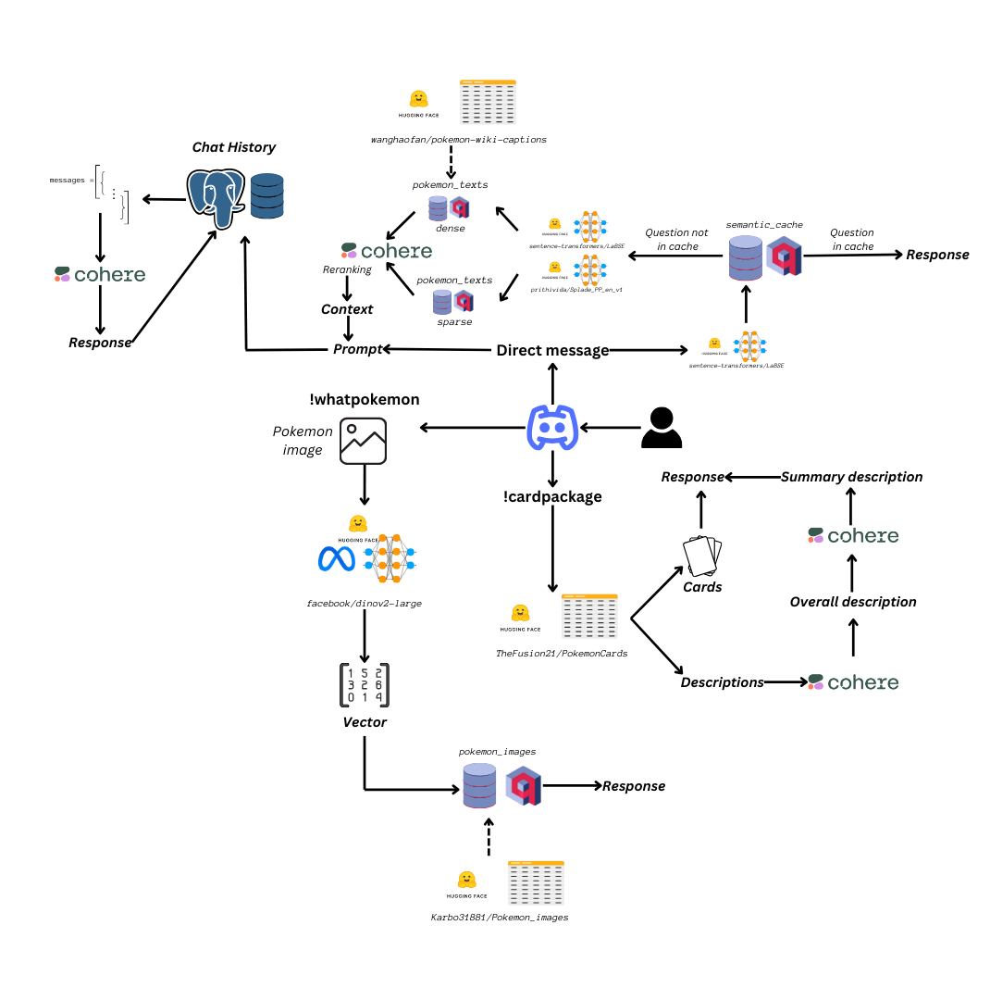

<h1 align="center">Pokemon Bot</h1>

<p align="center">
<a href="https://github.com/AstraBert/Pokemon-Bot">
    
</a>
<br/>

## Table of Contents

- [Quickstart](#quickstart)
    - [Pre-requisites](#pre-requisites)
    - [Create a Discord Bot](#create-a-discord-bot)
    - [Installation](#installation)
    - [Usage](#usage)
- [How does it work?](#how-does-it-work)
    - [Flowchart](#flowchart)
    - [Explanation](#explanation)
        - [Direct message as input](#direct-message-as-input)
        - [`!whatpokemon` command](#whatpokemon-command)
        - [`!cardpackage` command](#cardpackage-command)
- [Contributing](#contributing)
- [License](#license)
- [Funding](#funding)

## Quickstart

If you want to try PokemonBot without too many hassles, just follow these simple steps:

### Pre-requisites

- [`git` toolset](https://git-scm.com/docs)
- [`conda`](https://docs.conda.io/projects/conda/en/latest/user-guide/getting-started.html)
- [`docker`](https://www.docker.com/) and [`docker compose`](https://docs.docker.com/compose/)
- [Discord](https://discord.com/) and a Discord account
- [Cohere API key](https://docs.cohere.com/v2/docs/rate-limits) (get yours [here](https://dashboard.cohere.com/api-keys)): you should keep this under `cohere_api_key` in your [`.env`](./.env.example) file. 

### Create a Discord Bot

How do you create a Discord bot? It is really simple!
1. Go to [Discord](https://discord.com/) and create an account (or log into yours, if you already have one)
2. Create a new server by clicking on "Add a server" (a big green "+" button) and name it as you want
3. Go to [Discord developers portal](https://discord.com/developers/applications) and click on "New application"
4. Name your application, than save the changes and click on "Bot", on the left
5. There you will get the chance to name your bot and copy its token: paste it under the `discord_bot` field in your [`.env`](./.env.example) file.
6. After that, go on OAuth2 > URL generator and generate a URL that you will paste in your navigation bar, to add the bot to your newly created server.
7. In the `channel_id` field in your [`.env`](./.env.example) file, insert the **last number** that is displayed in your server's **#general channel url** when you open it on the web.

### Installation

- Clone this GitHub repository

```bash
git clone https://github.com/AstraBert/Pokemon-Bot.git
```

- Access the local folder

```bash
cd Pokemon-Bot
```

- Create a `conda` environment with all the needed dependencies

```bash
conda env create -f conda-environment.yaml
```

- Move `.env.example` to `.env` and modify the values of the keys according to the instructions in [Pre-requisites](#pre-requisites) and [Create a Discord Bot](#create-a-discord-bot). You can leave `pgql_user`, `pgql_psw` and `pgql_db` as they are. 

```bash
mv .env.example .env
```

### Launching

We first need to launch third-party services through `docker compose`:

```bash
# The -d option is not mandatory
docker compose up [-d]
```

Then we activate the `conda` environment:

```bash
conda activate pokemon_bot
```

And finally we launch the bot script:

```bash
python3 PokemonBot.py
```

It will take some time before the bot actually activates, because it has to load the necessary data and to configure its backend databases and caches. 

> _The activation time may vary according to hardware capacity, GPU availability and internet connection_

### Usage

Once the bot is set up, it will send an introductory message on your server and will explain how to use it. You should chat with the bot on direct messages, and not on the server channels:

- **Direct message (ask for info about Pokemon)**: if you send the bot a direct message, it will produce a response in 15 to 60s
- **Command `!whatpokemon` (identify a Pokemon image)**: If you put the command `!whatpokemon`, you should attach an image of a Pokemon and you will get out the name of it
- **Command `!cardpackage` (extract 5 Pokemon cards)**: If you input the `!cardpackage` command, you will get out 5 Pokemon cards with their description

## How does it work?

### Flowchart



### Explanation

#### Direct message as input

If a direct message with no command is provided to the bot, it will follow these step to produce a reply:

- Look in the **semantic cache** (managed with [Qdrant](https://qdrant.tech)) if the content of the message corresponds to something that was already asked. If so, the same response is given, if not, the bot adds the question to the cache and proceeds with the creation of a new answer. The search is performed with **dense retrieval** with the text encoder `sentence-transformers/LaBSE` available on [HuggingFace](https://huggingface.co/sentence-transformers/LaBSE)
- Perform **hybrid search** with dense (`sentence-transformers/LaBSE`) and sparse (`prithivida/Splade_PP_en_v1`, available on [HuggingFace](https://huggingface.co/prithivida/Splade_PP_en_v1)) retrieval combined. The database on which the search is carried on is a **Qdrant collection** that contains dense and sparse vectorial representations of the English texts from `wanghaofan/pokemon-wiki-captions` (available on [HuggingFace](https://huggingface.co/datasets/wanghaofan/pokemon-wiki-captions))
- The results from hybrid search are **reranked** thanks to [Cohere `rerank v3.5`](https://cohere.com/blog/rerank) and the top three hits are returned as context.
- The original user message and the retrieved context form the prompt, which is added to the **chat history** managed by a [Postgres](https://www.postgresql.org/) database instance.
- The chat history is retrieved and used to query [Cohere `command-r-plus-08-2024`](https://docs.cohere.com/reference/chat) via **API**
- The **response** is produced, returned to the user and added to chat history

#### `!whatpokemon` command

- The image attached to the `!whatpokemon` command message is **downloaded and saved** under the `pokemon_images/` directory as `pokemon_${time}.png`
- The image is then **vectorized** by the feature extractor `facebook/dinov2-large` (available on [HuggingFace](https://huggingface.co/facebook/dinov2-large))
- The vector is used to perform **dense retrieval** from an image database. The image database is a **Qdrant collection** that contains vectorial representations of the images in `Karbo31881/Pokemon_images` (available on [HuggingFace](https://huggingface.co/datasets/Karbo31881/Pokemon_images))
- The **label** associated to the retrieved image is returned and used as **response**

#### `!cardpackage` command

- Five cards are randomly drawn from `TheFusion21/PokemonCards` (available on [HuggingFace](https://huggingface.co/datasets/TheFusion21/PokemonCards))
- The image URLs are embedded as **images in Markdown format**
- The descriptions of the cards are used to produce an **overall, long description** of the package through [Cohere `command-r-plus-08-2024`](https://docs.cohere.com/reference/chat) via **API**
- The overall, long description of the card package is **summarized** thanks to a [Cohere `command-r-plus-08-2024`](https://docs.cohere.com/reference/chat) instance instracted to extract a **brief but enthusiastic description of the package** from the longer one. 
- The description and the embedded images are returned as a **response**

## Contributing

Contributions are always welcome!

Find contribution guidelines at [CONTRIBUTING.md](CONTRIBUTING.md).

## License

This project is open-source and is provided under an [MIT License](LICENSE).

## Funding

If you found it useful, please consider [funding it](https://github.com/sponsors/AstraBert).